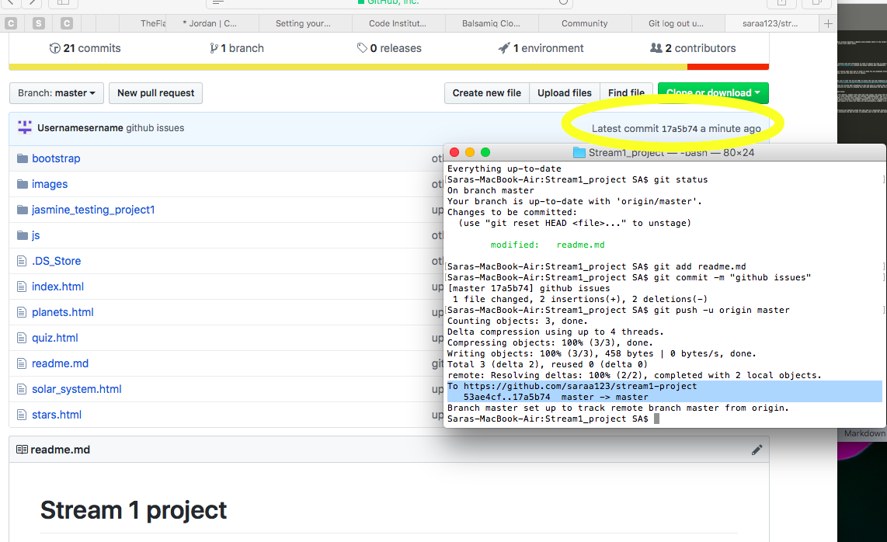

# Sara Akhtar's Stream 1 Project

## Overview

This is my stream 1 project, which involves building a website using methods learnt in the stream 1 section of the programme. I’ve chosen to base my website around facts about space because it is a personal interest of mine. 

There was an error during the deployment phase that has consequently affected the username displayed during my commits to this project; this has been specified below in the deployment section.  

## UX and UI

During the UX and UI planning process I considered who the website users would be, what they wanted to achieve, and how my website would allow them to do so. Therefore my primary goal was to build a website that offered easy manoeuvrability to the user, whilst also maintaining a pleasurable viewing experience.

I ensured the website reacts and adapts to different screen sizes due to the fact that there are now various device types the end user could be using. I also used simple colours that tried to create an environment surrounding the topic of the website. Javascript was utilised to transform some of the text and images when the user hovered over them. This gave me the ability to make the information more interesting. 

Wireframes were used during the planning stage to ensure the layout was coherent and easy to follow.

## Features

* Bootstrap – used to create a navbar, rows and columns. Doing so enabled me to make the website responsive.
* jQuery – used to transform certain text and images when the user hovers their mouse over them 

### Features left to implement 

In the future I would like to experiment with Javascript to create a more fluid and interactive website. 

## Methods used

1. HTML
2. CSS
3. Bootstrap
4. Javascript & jQuery 
5. Jasmine Testing

## Testing techniques 

Testing is an integral part of building code and programming in order to ensure the code is being executed correctly. When testing the code for this website http://jshint.com, Jasmine and manual testing were implemented. 

### Jasmine

The website http://jshint.com and Jasmine were both used in order to check for any potential errors within the Javascript code. There weren't any errors detected, and all the code ran as it should. 

### Manual testing

The following chrome plug in was used to test the CSS and HTML to ensure the site was responsive across various types of media and operating systems.: https://chrome.google.com/webstore/detail/responsive-web-design-tes/bdpelkpfhjfiacjeobkhlkkgaphbobea.

An issue concerning the images had occurred, whereby they weren’t fully responding to changed screen sizes. In order to resolve this I changed the container they were in, which would force the images to drop down below one another once the screen size was reduced.  

The quiz was also manually tested, whereby I ensured the user wasn’t allowed to go on to the next question without first picking an answer to the current question. If the user did try to continue without first picking an answer, an error message would flash on the users screen.

## Deployment and issues that had arisen 

Github has been used to deploy this website, however there have been some issues. The issue that arises regards my commits, whereby each commit I have done is being registered under the username “Usernamesername” due to a bug when starting the project. With the help of my mentor as well as using the Slack community, I attempted to resolve this issue, however I was unable to do so. My mentor and I had decided against starting a new project repository in order to maintain my commit history. Due to this error, the project repository page appears to state that there are two contributors, however I am the only contributor to this project.

The image below details the message that is shown when committing new code, and also ensures that these are indeed my own commits. 

## Credits

### Media

All the pictures that have been used in this website have been searched on Google, and saved in a separate images folder within the project file. 

### Acknowledgements 

The Javascript quiz code was influenced and modelled around the code used in a Javascript tutorial. However, it has been simplified in order to make the quiz easier to read and understand.

**This is for educational purposes**
